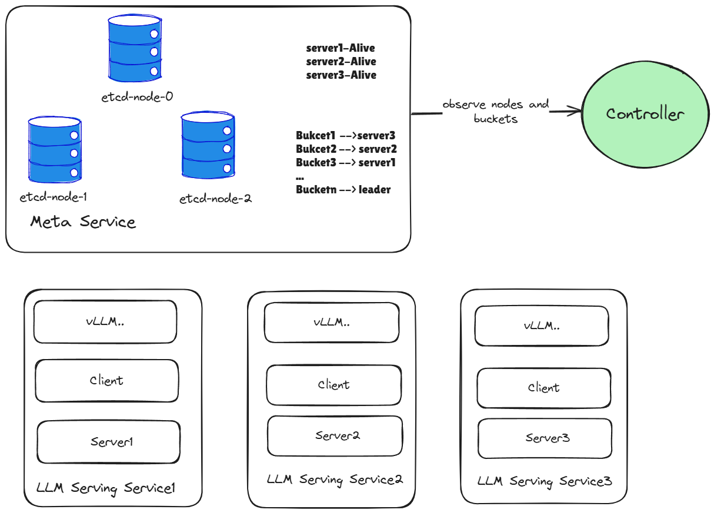

# Mooncake Store

## 概述

Mooncake Store 是一款专为LLM推理场景设计的高性能**分布式键值KV Cache存储引擎**。与 Redis 或 Memcached 等传统缓存系统不同，Mooncake Store 的核心定位是**KV Cache的 存储引擎而非完整的缓存系统**。它提供了底层对象存储和管理功能，而具体的缓存策略（如淘汰策略）则交由上层框架（比如vLLM）或用户实现，从而提供更高的灵活性和可定制性。

Mooncake Store 的主要特性包括：

*   **对象级存储操作**：提供简单易用的对象级 API，包括 Put、Get、Replicate 和 Remove 操作，方便用户进行数据管理。
*   **多副本支持**：支持为同一对象保存多个数据副本，有效缓解热点访问压力。
*   **最终一致性**：保证 Get 操作读取到完整且正确的数据，但不保证读取到最新写入的数据。这种最终一致性模型在确保高性能的同时，简化了系统设计。
*   **高带宽利用**：支持对大型对象进行条带化和并行 I/O 传输，充分利用多网卡聚合带宽，实现高速数据读写。
*   **灵活的落盘策略**：支持 Eager、Lazy 和 None 三种将数据持久化到慢速存储的策略，满足不同场景下的数据持久化需求。
*   **动态资源伸缩**：支持动态添加和删除节点，灵活应对系统负载变化，实现资源的弹性管理。



## C/C++ API

### Get 接口

```C++
StatusCode Get(const String& object_key, std::vector<Slice>* slices);
```

用于获取 `object_key` 对应的值。该接口保证读取到的数据是完整且正确的，但不保证是最新版本的数据。

读取到的值将通过 TransferEngine 存储到 `slices` 所指向的内存区域中。 
### Put 接口

```C++
struct ReplicateConfig {
    uint64_t replica_num; // 指定对象的副本数量
};

StatusCode Put(const ObjectKey& key, const std::vector<Slice>& slices, const ReplicateConfig& config);
```

用于存储 `key` 对应的值。可通过 `config` 参数设置所需的副本数量，系统中的 Leader 节点将**尽最大努力**完成数据复制。、

### Remove 接口
```C++
StatusCode Remove(const ObjectKey& key);
```
用于删除指定 key 对应的对象。该接口会移除存储引擎中与 key 关联的所有数据副本。如果删除操作成功，相关的资源将被释放，确保后续的存储空间可以被重新利用。

### Replicate接口
```C++
StatusCode Replicate(const ObjectKey& key, const ReplicateConfig& config);
```
用于调整指定 key 对象的副本数量。通过 config 参数，可以动态指定所需的副本数量，系统将尽最大努力完成副本的增加或减少，以满足高可用性和容错性的需求。

## 架构

Mooncake Store 采用分层架构设计，架构自顶向下分为：`DistributedObjectStore`、`ReplicaAllocator`、`BufferAllocator`，并结合 `AllocationStrategy` 策略类协调分配行为。

`DistributedObjectStore`作为顶层模块，`DistributedObjectStore` 是整个系统的服务入口，它负责处理包括路由、容错在内的分布式协调逻辑，并为用户提供对象存储的高级操作，如put（存储对象）、get（获取对象）、replicate（副本操作）、remove（删除对象）。

`ReplicaAllocator`位于中间层，负责管理对象的副本。它接收来自`DistributedObjectStore` 的指令执行副本操作，并与底层的 BufferAllocator 交互以分配实际的存储资源。

`BufferAllocator` 作为底层资源分配器，负责实际的内存分配和释放。它基于 Facebook 的 CacheLib MemoryAllocator 实现底层内存管理，向上层 `ReplicaAllocator` 提供了一个抽象接口。

### DistributedObjectStore

基于集群的元数据服务（目前采用 etcd）的分布式协调方案，通过引入水平切分的 Key Space 和集群化存储架构，实现了高可用的分布式KV 存储服务。

我们将整个 key space 划分为多个 bucket。bucket 的数量由系统规模和预期的负载决定，参照 Redis 集群的实践，我们可以选择将 key space 划分为 16384 (2^14) 个 bucket。这样可以确保 key 充分打散，有效减少集群中热点分片出现的概率，提升整体性能。

考虑到底层Allocator实现的复杂度问题，我们采用了水平切分 + leader方案，以简化整体实现。不同于垂直切分（Vertical Scaling）将不同分区的键值对存储在不同节点，Mooncake Store采用水平切分策略。我们将整个系统的一个横切面看做一个bucket，又或者说每个bucket都包含了所有服务器节点。每个节点都参与存储所有的 bucket 数据，对于每个特定的 bucket，只有一个节点会被选为 Leader，负责处理该 bucket 的读写请求。

系统采用一个中心化调度器负责 Bucket Leader 的分配。调度器通过与元数据服务交互来监控集群中各节点的状态，并在必要时（如 Leader 节点故障）进行 Leader 重新分配，确保系统的高可用性。

#### 中心化调度器的设计

调度器本身不存储任何状态，所有状态信息均存储在集群的元数据服务中。调度器的职责主要是通过元数据服务监控集群中的关键状态变更，并根据需要触发对应的操作。
调度器是集群的“旁观者”，负责监听和扫描两类关键的 key-value 数据，而不直接参与数据存储。
- NodeInfo: 每个结点的状态信息
  - 定义：节点的状态信息，包括负载、压力、以及当前承担的 bucket leader 数量。
  - Etcd 存储路径：/nodes/{node_ip:port}
  - 心跳机制：节点通过元数据服务的 ttl/lease等 模拟心跳。
  - 状态更新：其他状态本质是为了辅助调度器更好的决策
  - 定义示例
```C++
struct NodeInfo {
  string ip;
  int port = 2;
  int capacity = 3;
  int leader_num = 4;
  // ... 其他资源信息，例如 GPU使用率，网络情况
};
```
- BucketInfo: 每个的bucket的信息.
  - 定义：存储分片的状态信息，主要用于记录其所属 leader 节点及其他元数据。
  - Etcd 存储路径：/buckets/{bucket_id}。
  - 心跳机制：bucket的leader通过元数据服务的 ttl/lease等 模拟心跳。

```C++
struct BucketInfo {
  int bucket_id; // Bucket ID
  NodeInfo leader; // Leader 节点信息
  // 也可以继续添加其他信息，比如hit ratio
}
```

**调度器主要负责为失效的bucket选择新leader。**

调度器上线的时候，会启动两个线程运行各自的逻辑
监听模式：调度器监听 /buckets/ 路径下的delete事件，用于快速处理bucket leader失效问题。
```C++
// 监视 etcd 中的bucket变化
void WatchBuckets() {
    etcd::Watcher watcher(
        client_, "/buckets/",
        [this](etcd::Response response) { HandleBucketChange(response); });
    // 永远运行
}

// 处理bucket的状态变更
void HandleBucketChange(const etcd::Response &response) {
    // bucket leader失效
      if (response.action() == "delete") {
        std::string bucket_key = response.prev_value().key();
        int bucket_id = ExtractBucketId(bucket_key);
        // 分配新leader
        AssignNewLeader(bucket_id);
      }
       // 其他操作...
}
```
轮询模式：调度器以一定的时间间隔，扫描/nodes/和/buckets/下的key-value对，也需要补齐，顺带可以做监控，调试等
```C++
// 扫描整个集群状态
void ScanClusterState() {
    // 获取所有buckets
    auto buckets_response = client_.ls("/buckets/").get();
    // 检查是否有没有分配的bucket
    std::set<int> assigned_buckets;
    for (const auto &value : buckets_response.values()) {
        assigned_buckets.insert(ExtractBucketId(value.key()));
    }

    for (int i = 0; i < BUCKET_NUM; ++i) { 
        // 处理失效bucket
        if (assigned_buckets.find(i) == assigned_buckets.end()) {
            AssignNewLeader(i);
        }
    }
}
```
#### Leader分配逻辑
调度器根据当前在线节点的情况，选择一个合适的节点作为该 bucket 的 leader，通常会选择 leader_num 最少的节点。然后，调度器通过 RPC 将 BucketInfo 信息发送给选定的 leader。新任命的 leader 接收到任命后，需要创建相应的 key-value 对，并创建 lease，随后开始接受客户端的服务。如果 leader 续约 lease 失败，将自动拒绝服务。

#### 节点失效处理

在发生 Failover 时，节点下线后，调度器不会立即执行操作。这是因为该节点可能没有承担任何 bucket，仅是一个空节点，其下线不会对集群的正常服务产生影响。对于 Bucket 的下线，从调度器的角度来看，本质上是 leader 未能续约 lease。调度器通过监听 /buckets/ 路径，接收到 delete 事件，或者在扫描时发现缺失的情况下，会执行相应的 bucket 分配操作。

#### 校验码

client的get流程
1. client询问leader拿到对应replica list
2. 直接获取对应节点获取相应数据

那么在1,2步骤之间，leader失效，有小概率事件，旧leader失效，新leader上任，且新leader刚好重新使用了这块区域，那么client就会拿到错误的值。
为了防止client拿到错误数据的解决方法，我们需要在value上加一个checksum，client收到数据后做二次验证。

